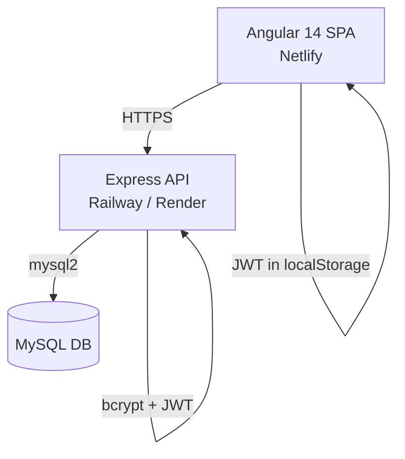

# System Architecture — Jamaican Heritage E-Commerce

## Overview

## Three-Tier Architecture

| Layer    | Technology     | Host                  | Purpose                              |
| -------- | -------------- | --------------------- | ------------------------------------ |
| Frontend | Angular 14     | Netlify               | SPA with lazy-loaded modules         |
| Backend  | Node / Express | Railway / Render      | REST API, auth, business logic       |
| Database | MySQL          | Railway / PlanetScale | Persistent user, product, order data |

## API Endpoints

| Method | Endpoint                   | Auth | Description                   |
| ------ | -------------------------- | ---- | ----------------------------- |
| POST   | `/api/auth/register`       | ✗    | Register new user             |
| POST   | `/api/auth/login`          | ✗    | Login, receive JWT            |
| GET    | `/api/products`            | ✗    | List products (filter/search) |
| GET    | `/api/products/:id`        | ✗    | Single product                |
| GET    | `/api/products/categories` | ✗    | List categories               |
| POST   | `/api/orders`              | ✓    | Place order                   |
| GET    | `/api/orders`              | ✓    | User's orders                 |
| GET    | `/api/orders/:id`          | ✓    | Single order detail           |
| GET    | `/api/users/profile`       | ✓    | Get user profile              |
| PUT    | `/api/users/profile`       | ✓    | Update name / email           |

## Data Flow

1. User opens the SPA → Angular loads from Netlify CDN
2. Public pages (Home, Shop, About, Info) render immediately
3. Login / Register → POST to Express → bcrypt hash → JWT returned → stored in localStorage
4. Authenticated requests → JWT interceptor attaches Bearer token
5. Protected pages (Dashboard, Cart, Orders, Profile) → AuthGuard checks token
6. Orders → DB transaction (order + order_items) with server-side price calculation
